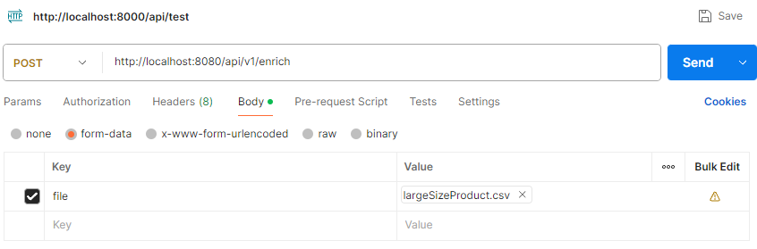
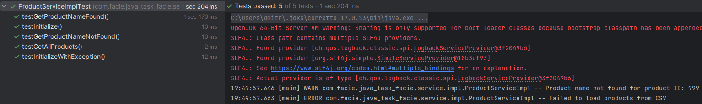

# Trade Enrichment Service

---

## How to Run the Project
### Prerequisites
- Java 17+
- Maven 3.6+
- Redis (for caching product names)
- Docker (optional, for containerized deployment)

### Running Locally
1. Clone the repository:
   ```bash
   git clone <repository-url>
   cd <project-directory>
   ```
2. Start Redis:
   ```bash
   docker run -p 6379:6379 redis
   ```
3. Build the project:
   ```bash
   mvn clean install
   ```
4. Run the application:
   ```bash
   mvn spring-boot:run
   ```

The application should now be running at `http://localhost:8080/api/v1`.

---

## API Usage

### 1. Enrich Trades via Plain Text CSV Upload
**Endpoint:**
```
POST /api/v1/enrich
```
**Headers:**
```
Content-Type: text/plain
```
**Body:**
A raw CSV file stream with trades data.

**Example Request:**
```bash
curl -X POST "http://localhost:8080/api/v1/enrich" \
     -H "Content-Type: text/plain" \
     --data-binary @trades.csv
```

**Response:**
- A CSV file containing enriched trade data.

### 2. Enrich Trades via Multipart File Upload
**Endpoint:**
```
POST /api/v1/enrich
```
**Headers:**
```
Content-Type: multipart/form-data
```
**Body:**
A file upload containing a CSV file.

**Example Request:**
```bash
curl -X POST "http://localhost:8080/api/v1/enrich" \
     -H "Content-Type: multipart/form-data" \
     -F "file=@trades.csv"
```
**Postman:**




**Response:**
- A CSV file containing enriched trade data.
- 

---

---

## Configuration
### `application.properties`
Modify the `application.properties` file in `src/main/resources/` to configure application settings, such as:
```properties
spring.application.name=java-task-facie

spring.data.redis.host=localhost
spring.data.redis.port=6379
spring.cache.type=redis
spring.cache.redis.time-to-live=600000 // Maybe more

spring.servlet.multipart.max-file-size=50MB  //Maybe more than 50
spring.servlet.multipart.max-request-size=50MB //Maybe more than 50

logging.level.com.facie.java_task_facie=INFO
```

---

## Running with Docker
You can build and run the application using Docker:
```bash
docker build -t trade-enrichment .
docker run -p 8080:8080 trade-enrichment
```

---

## Logs & Monitoring
The application logs processing details using SLF4J. Logs are printed to the console and can be viewed in the terminal where the application is running.

---

### Conclusion
- Translate the `productId` into `productName`. - **DONE**
- Perform data validation:  - **DONE**
    - Ensure that the `date` is a *valid* date in `yyyyMMdd` format, otherwise discard the row and log an error.
    - If the product name is not available, the service should log the missing mapping and set the product Name as: `Missing Product Name`.
- Be able to handle:  - **DONE**
    - very large sets of trades
        - ( it is better if you could optimize the code to handle **millions** of trades).
    - a large set of products  - **DONE**
        - ( it is better if you could optimize the code to handle - 10k to 100k).
- Return the enriched trade data.  - **DONE**
- Optional Enhancements: Async Processing  - **DONE**

### TESTS

